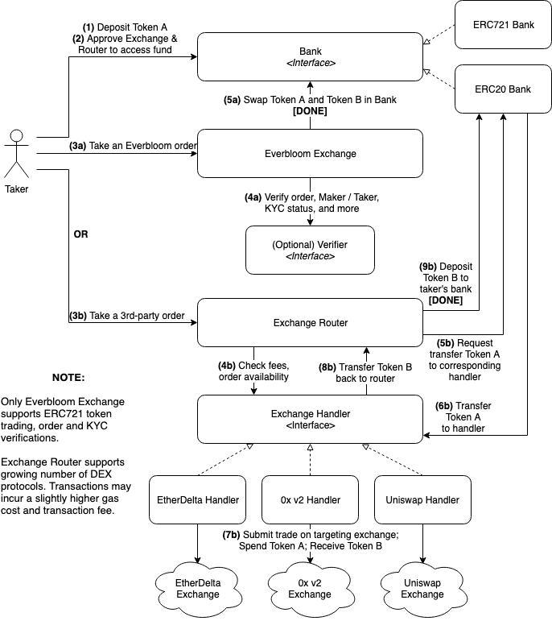

# Everbloom Smart Contracts

Everbloom smart contracts allow users to trade cryptocurrencies atomically across multiple decentralized exchange (DEX) protocols on the Ethereum blockchain. Users can interact with the following three smart contract modules.

## Modules

### 1. Bank
[IBank](bank/IBank.sol) is the interface for all Bank implementations. We have currently implemented [ERC20Bank](bank/ERC20Bank.sol) and [ERC721Bank](bank/ERC721Bank.sol).

The Bank provides deposit, withdraw and transfer functions while ensuring user fund safety. As a module, Bank works independently. Users do not need to migrate their deposit/allowance whenever the exchange code is updated. Users have complete control of their funds. Only the addresses authorized by both the user and Everbloom have access to user’s fund.

[BankUtil](bank/BankUtil.sol) is an utility contract which can query user deposits by batch ([DeltaBalances](https://deltabalances.github.io/) alternative).

### 2 Everbloom Exchange
[EverbloomExchange](EverbloomExchange.sol) is a standalone DEX which uses off-chain order book and on-chain settlement, supports ERC20 and ERC721 token trading, batch trading, order matching, market/limit orders, compliant trading (KYC/AML verification), fee sharing, and other features.

The exchange utilizes the [IBank](bank/IBank.sol) contract to swap funds, and the [Verifier](verifier/Verifier.sol) contract (optional) to verify order eligibility and maker/taker KYC status.

### 3 Exchange Router
In order to support liquidity from other DEXs, we designed [ExchangeRouter](router/ExchangeRouter.sol) contract to route and handle trading logics required by each DEX.

We uses a generic order structure as input of the router. For each supported DEX, we developed a different exchange handler that implements the same [IExchangeHandler](router/IExchangeHandler.sol) interface.

The router transfers user's fund from [ERC20Bank](bank/ERC20Bank.sol) to the corresponding handler according to the handler address from the generic order. The handler receives the fund and use it to execute trade and pay fees on the targeting DEX, then sends back the token received from the trade to the router. Finally, the router deposits the token received into user's Bank balance.

Due to compatibility reasons, currently the router only support ERC20 token trading.

## Deployed Contract Addresses
- ERC20Bank - [0x21f01a22c417864b20fc9ccbb9b709ad38a9ea8d](https://etherscan.io/address/0x21f01a22c417864b20fc9ccbb9b709ad38a9ea8d)
- BankUtil - [0x0388ddf9e128605138aa9d470e34966b7114c5c1](https://etherscan.io/address/0x0388ddf9e128605138aa9d470e34966b7114c5c1)
- EverbloomExchange - [0x146f603102d322c1aebf3d7be8b2d54e64e33327](https://etherscan.io/address/0x146f603102d322c1aebf3d7be8b2d54e64e33327)
- ExchangeRouter - [0xcd35a7d24a5dba901da340f65a06a19d47a70bf1](https://etherscan.io/address/0xcd35a7d24a5dba901da340f65a06a19d47a70bf1)
- EtherDeltaHandler - [0xa838b13a913f1024ee99cab7335aebf15add5f38](https://etherscan.io/address/0xa838b13a913f1024ee99cab7335aebf15add5f38)
- ZeroExV2Handler - [0x6e7d8acccbe37a8fea899af1e0eb2cfa6a408ee8](https://etherscan.io/address/0x6e7d8acccbe37a8fea899af1e0eb2cfa6a408ee8)
- UniswapHandler - [0xc4b8673b083c2bccb67968a0236539ae5266b844](https://etherscan.io/address/0xc4b8673b083c2bccb67968a0236539ae5266b844)